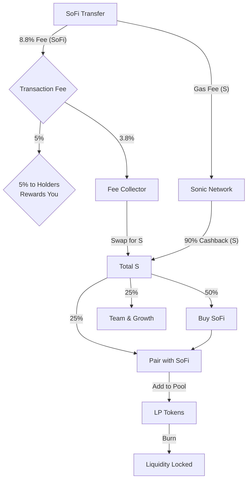
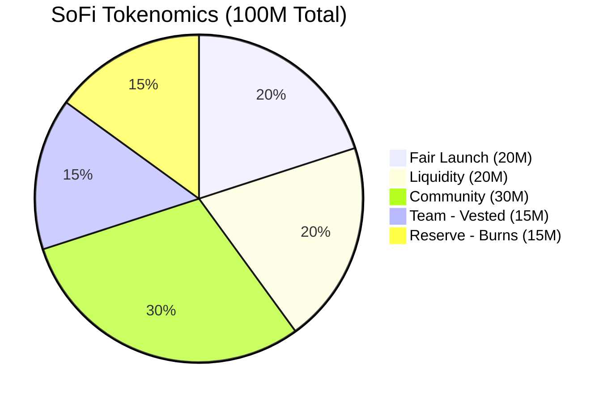
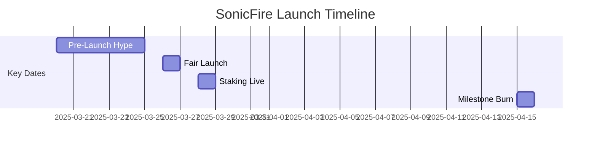

# SonicFire (SoFi): Ignite Your DeFi Future on Sonic

*Burn Bright, Build Trust, Win Together.*

## Background

Decentralized finance (DeFi) promises endless opportunities but often delivers confusion and empty hype. [**SonicFire (SoFi)**](https://www.sonicfi.re) flips that script. Built on Sonic—one of crypto’s fastest and most affordable blockchains—SoFi harnesses community-driven economics to create sustainable wealth. We call it **Social Finance**: your trust and engagement fuel our collective success.

## Introduction

Welcome to **SonicFire (SoFi)**, the token that sparks growth with every trade. With a transparent **8.8% transfer fee**, SoFi rewards holders, permanently locks liquidity, and reduces token supply—boosting your investment’s strength and value. But SoFi isn’t just another DeFi token: it’s the foundation of a vibrant blockchain gaming ecosystem, kicking off with our anticipated game, **Sonic Pyramid Builder**.

Ready to join the fire? Here's everything you need to know.

## Why We Chose Sonic Blockchain

Sonic isn't ordinary—it’s a powerhouse Layer-1 blockchain, supporting up to **10,000 transactions per second** with near-instant finality. For SoFi holders, this means lightning-fast transactions and ultra-low fees, ideal for gaming and frequent trading.

Sonic’s unique **Fee Monetization Program** returns up to **90% of transaction fees** to us in Native Sonic (S). These rewards fund continuous SoFi buybacks and liquidity burns, fueling steady, long-term growth. Sonic’s speed and cost-efficiency make it the ideal blockchain for SonicFire.

## Experienced Team & Transparency

Our team combines deep expertise in DeFi innovation, blockchain gaming, and community-driven projects. Here's how we're earning your trust:

- **Team Token Vesting**: 15% of tokens vested over **24 months**, with a **6-month cliff** and gradual monthly unlocks—ensuring long-term commitment.

- **Smart Contract Audits**: Audited by [SafeDe.fi](https://safede.fi) pre-launch, with full public transparency.

- **Contract Verification**: SoFi’s smart contract will be publicly verified on Sonic's block explorer immediately post-launch.

## Reward System: Sustainable and Deflationary

SoFi’s tokenomics are built for sustainable, long-term value. Every holder benefits from these transparent mechanisms:

- **8.8% Transfer Fee Breakdown**:  
  - **5% Holder Rewards**: Automatically redistributed to all holders—generating passive income directly in your wallet.  
  - **3.8% Growth Fund**: Converted into Native Sonic (S) tokens, funding ongoing buybacks and burns.

- **Buyback & Burn Cycle**:  
  Transaction fees in Sonic (S) buy back SoFi tokens. These are paired with S and added to liquidity pools. We then permanently burn these liquidity provider (LP) tokens, locking liquidity and continuously shrinking SoFi’s available supply.

- **Early Adopter Bonuses**:  
  First **1,000 buyers** receive a **20% SoFi bonus**. Early staking offers up to **50% APR**, decreasing incrementally by 5% per 1,000 stakers to ensure sustainability.

- **Milestone Burns**:  
  Achieve **10,000 holders** and we'll burn **5 million SoFi** tokens. Each significant milestone means larger burns, constantly increasing scarcity and value.

*Figure 1: Fees Fuel Value*—Every trade powers your rewards.

## Tokenomics: Fair, Finite, Community-First

SoFi launches with a finite supply of **100 million tokens**, specifically designed for trust, transparency, and long-term growth:

- **Initial Token Distribution**:
  - **20% Fair Launch**: Open and accessible to everyone on Sonic’s decentralized exchange—no special insiders.
  - **20% Liquidity Pool**: Paired with S tokens, LP tokens burned immediately on launch day.
  - **30% Community Rewards**: Dedicated to staking, gaming incentives, and community airdrops.
  - **15% Team Tokens**: Locked and vested, with a 12-month cliff and gradual monthly releases.
  - **15% Strategic Reserve**: For future burns, partnerships, and community-driven initiatives unlocked through governance votes.

- **Token Utility**:  
  Use SoFi for governance voting via Snapshot.org, staking pools, and buying in-game assets in our gaming ecosystem.

*Figure 2: Community-First*—50% goes to you and liquidity.

Why choose an 8.8% transfer fee? It strikes the ideal balance between meaningful growth funding and attractive transaction economics, inspired by successful community-driven projects like SafeMoon. We’ll reassess this with community input after six months.

## SonicFire Initial Launch Timeline

Mark your calendars—this is your chance to join the SonicFire community from the start:

- **March 20–25, 2025**: Pre-launch community campaign with giveaways and announcements.
- **March 26, 2025**: Fair Launch at 12:00 UTC on Sonic DEX; first 1,000 buyers receive a 20% token bonus.
- **March 28, 2025**: Staking platform goes live—up to 50% APR for early participants.
- **April 15, 2025**: First milestone check—hit 10,000 holders and burn 5 million SoFi tokens.

### Milestone-Based Burn Schedule

| Milestone          | Tokens Burned |
|--------------------|---------------|
| 10,000 Holders     | 5,000,000     |
| 50,000 Holders     | 10,000,000    |
| $10M Market Cap    | 15,000,000    |

*Figure 3: Get In Early*—Time’s ticking!

## Beyond the Token: Gaming & Future Growth

SoFi unlocks access to **Sonic Pyramid Builder**, releasing soon after the token sale (Beta: Q2 2025, full release: Q3 2025). Build digital pyramids, earn dividends, participate in governance decisions, and enjoy upcoming NFT integrations. More games and utilities are planned—your investment today fuels tomorrow’s innovations.

## Risk and Responsibility

Cryptocurrency involves inherent risks: volatility, regulation, adoption hurdles. Invest responsibly, do your research, and remember—this is not financial advice. We're here for sustainable growth, transparency, and community—not short-term hype.

## Why SonicFire?

Unlike speculative meme tokens, SoFi leverages deflationary tokenomics and Sonic’s fee rebate system for robust growth. Permanent liquidity locking, audited smart contracts, and the commitment to **So**cial **Fi**nance make SonicFire a genuine community-powered project. Post-launch, expect consistent community engagement, regular AMAs, transparency reports, and pursuit of a Tier-1 centralized exchange listing by late 2025.

### Get Connected:

- **Whitepaper Release**: March 20, 2025  
- **Website**: [sonicfi.re](https://www.sonicfi.re)  
- **Twitter**: [@SonicFireSoFi](https://twitter.com/SonicFireSoFi)  
- **Discord**: *(Invite coming soon)*  

*March 16, 2025 — The spark is lit. Are you ready to fan the flame?*
